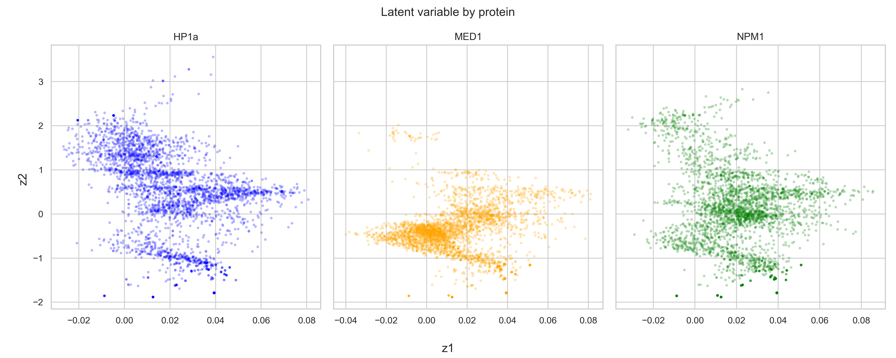

# VAE to encode protein condensate + small molecule trajectory data

## Requirements
- numpy
- pandas
- tqdm
- sklearn
- pytorch
- torchvision
- pyro
- seaborn

## Data format

Data format is expected to be a csv with each row as a datapoint. If your data has a label column and you'd like to exclude it from the representation, pass in `label_col=NAME_OF_COL` to the `InteractionDataset` initialization in `trainer.py`. The default `label_col` is `protein`.

## Training

In train.py, 
1. update `DATA_DIR` and `MODEL_DIR` to be compatible with your directory setup.
2. run `python train.py --input_dim 239 --z_dim 16 --hidden_dim 64` or whatever your desired dimensions are.

If you'd like to use a slurm submission script (particularly with MIT's SuperCloud), edit the `llsub.sh` file and try running `LLsub llsub.sh -g volta:1`. If you are using a conda environment, change the name (mine is called `pcsm`).

## Evaluation

An example of running evaluation is included in `llsub.sh`.
